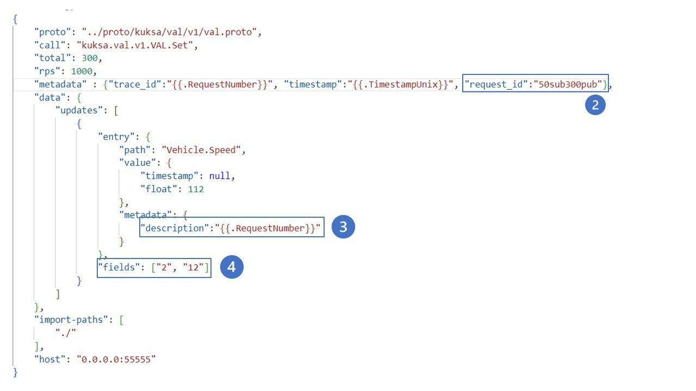
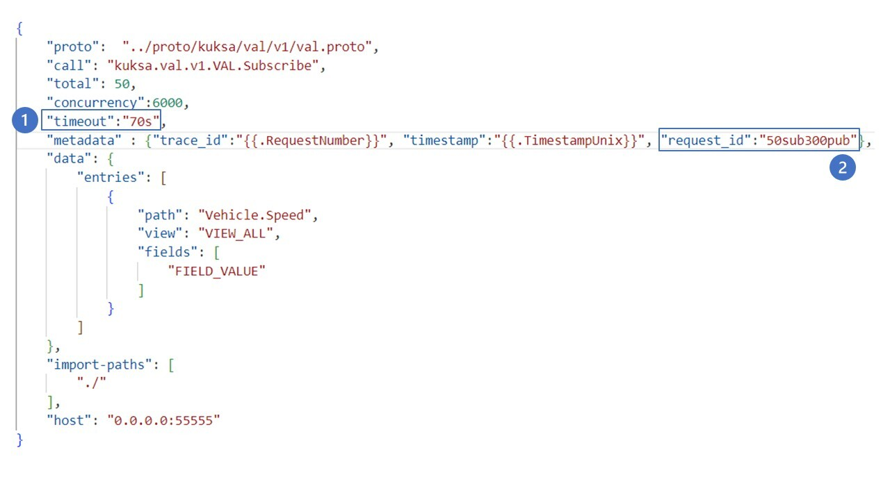
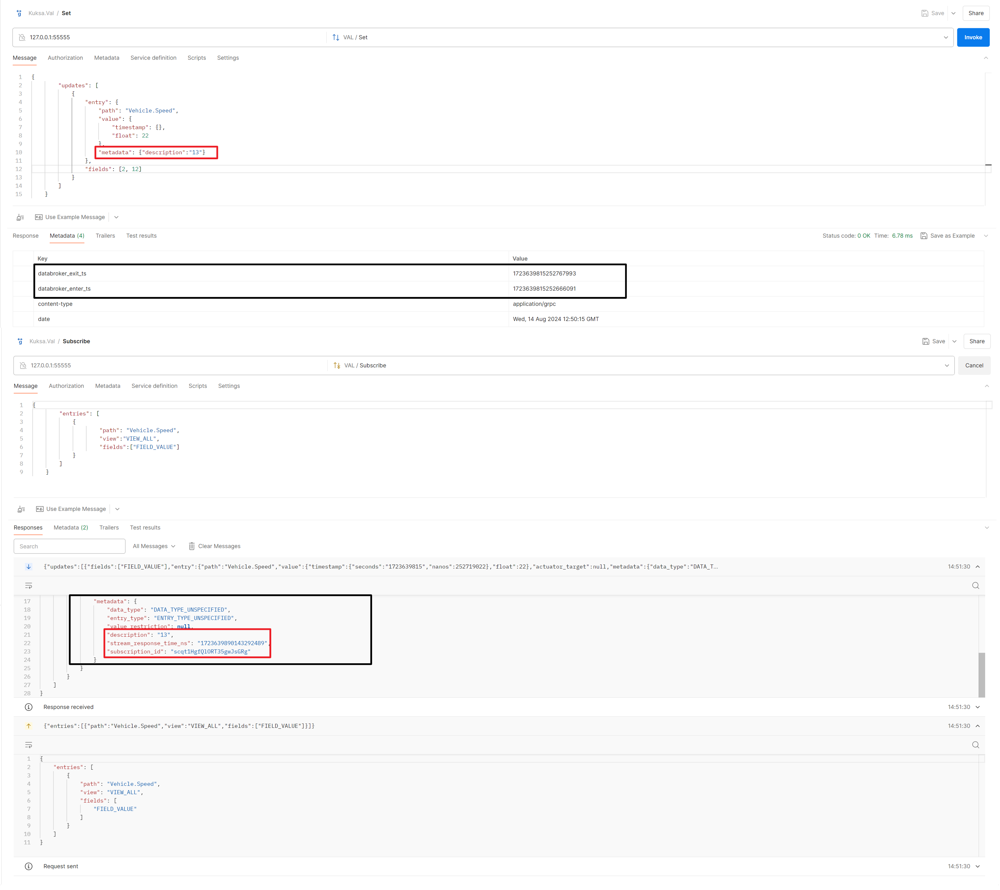
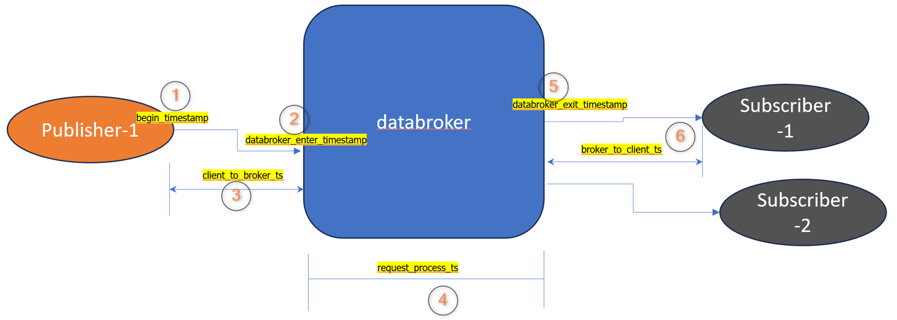

# GHZ Custom

A repository for managing and making gRPC calls using the `ghz` tool.

## Table of Contents

- [Getting Started](#getting-started)
  - [Prerequisites](#prerequisites)
  - [Installation](#installation)
- [Starting the Database](#starting-the-database)
- [Making gRPC Calls](#making-grpc-calls)
  - [Publish Call](#publish-call)
  - [Subscribe Call](#subscribe-call)
- [Sample Config-files Structure](#sample-config-files-structure)
- [Metadata used to monitor latency](#metadata-used-to-monitor-latency)
- [ Pictorial representation of end to end latency calculation](#pictorial-representation-of-end-to-end-latency-calculation)
- [building ghz for arm64 architecture](#building-ghz-for-arm64-architecture)
- [building ghz-web for arm64 architecture](#building-ghz-web-for-arm64-architecture)
- [Commands used for testing on L4S testbed](#commands-used-for-testing-on-L4S-testbed)
- [copy report locally](#copy-report-locally)
- [graph generator](#graph-generator)


## Getting Started

### Prerequisites

Before you begin, ensure you have met the following requirements:

- You have `git` installed.
- You have `chmod` and `sudo` permissions.

### Installation

To clone the repository, run:

```sh
git clone https://github.boschdevcloud.com/SAI1RNG/ghz-custom.git -b feature/main
```

## Starting the Database

```sh
cd ghz-custom/cmd/ghz-web
chmod +x ./ghz-web
sudo ./ghz-web
```
## Making gRPC Calls
```sh
cd ghz-custom/cmd/ghz
chmod +x ./ghz
```
### Publish Call
```sh
./ghz --insecure --config=config.json
```

### Subscribe Call
```sh
./ghz --insecure --config=config_subscribe.json json
```

### Publish Call (with Database)
```sh
./ghz --insecure --config=config.json -O json | http POST localhost:80/api/ingest
```

### Subscribe Call (with Database)
```sh
./ghz --insecure --config=config_subscribe.json json | http POST localhost:80/api/ingest
```

## Sample Config-files Structure
<div>
  <div style="float: left; width: 45%;">
    <ol>
      <li><strong>timeout</strong>: The amount of time the ghz is required to subscribe to kuksa-databroker <code>{{.RequestNumber}}</code> placeholder.</li>
      <li><strong>request_id</strong>: This acts as a identifier to differntiate between multiple tests conducted. Example: <code>50sub300pub</code> indicates an experiment with 50 subscribers and 300 publish calls, request_id can be anything helping identify between tests.</li>
      <li><strong>description</strong>: Provides additional information about the request. Uses the <code>{{.RequestNumber}}</code> placeholder.</li>
      <li><strong>fields</strong>: An array specifying data fields to be kept track of, such as <code>["2", "12"]</code>, here having <b>"12"</b> is a must.</li>
    </ol>
  </div>
  <div style="float: right; width: 45%;">
    
    <br>
    
  </div>
  <div style="clear: both;"></div>
</div>


Note: The combination of `request_id` and `description` forms a unique id for identifying a particular publish call in a given test.

## Metadata used to monitor latency



- latency related metadata for publish call is recieved in the metadata of Http respone.
- latency related metadata for subscribe call is received within the payload of the subscription response.

## Pictorial representation of end to end latency calculation



##  building ghz for arm64 architecture

use below docker command and inject the custom-ghz repo as a volume inside the golang docker container

 ```docker run -it -v $PWD:/go/work golang:1.20-alpine ```
 
 traverse to the cmd/ghz folder and execute below command
 
 ```go build . ```

## building ghz-web for arm64 architecture

 ```docker run -it -v $PWD:/go/work golang:1.20```  

use Docker container for building ghz-web as it requires several dependencies

from the root folder (/go/work/ghz-custom) execute the below command

 ```apt-get install libc6 ```

 ```CGO_ENABLED=1 GOOS=linux GOARCH=arm64 go build -x -buildvcs=false -a -ldflags="-extldflags '-static' -s -w -X 'main.version=$(git rev-parse --abbrev-ref HEAD)' -X 'main.commit=$(git rev-parse HEAD)' -X 'main.date=$(date -u +%Y-%m-%dT%H:%M:%SZ)'" -o ./dist/ghz-web-custom-arm ./cmd/ghz-web/... ```